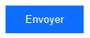
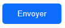

# Svelte Component/Button.svelte
### Here is a presentation of the button and a preview.

```html
<script>
    import { Button } from "./components/Button/Button.svelte" // edit with the path to the Button.svelte file
</script>

<Button text="My Button" style="modern"> <!-- Here are the needed arguments, all others are optionnals -->

<!-- If you want to edit the style of the button like the background-color, you have to do it as global like it -->
<style>
    :global(button) {
        background-color: #f00; /* red */
    }
</style>
```

# Preview of the default button
### Modern
 <br>
### Round
