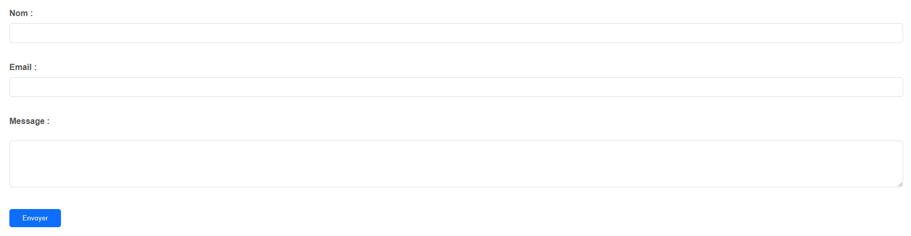

# Svelte Component/Form.svelte
### Here is a presentation of the form and a preview.

```html
<script>
    import { Form } from "./components/Form/Form.svelte" // edit with the path to the Form.svelte file
</script>

<Form action="#" method="post"> <!-- Here are the needed arguments, all others are optionnals -->

<!-- If you want to edit the style of the form like the padding, you have to do it as global like it -->
<style>
    :global(form) {
        padding: 3%;
    }
</style>
```

# Preview of the default form
 <br>