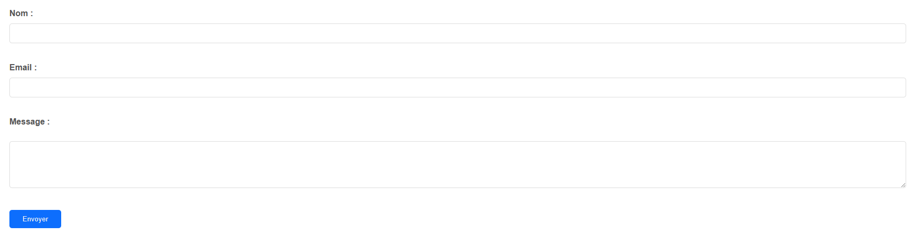
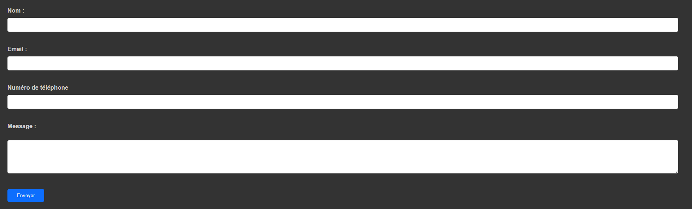

# Svelte Components/Form.svelte (v1.1)
### Here is a presentation of the form and a preview.

```html
<script>
    import { Form } from "./components/Form/Form.svelte" // edit with the path to the Form.svelte file
</script>

<Form action="#" method="post">
    <label for="nom">Nom :</label>
    <input type="text" id="nom" name="nom" required /><br><br>

    <label for="email">Email :</label>
    <input type="email" id="email" name="email" required /><br><br>

    <label for="phone">Numéro de téléphone</label>
    <input type="tel" name="phone" id="phone" required><br><br>

    <label for="message">Message :</label><br>
    <textarea id="message" name="message" rows="4" cols="50" required /><br><br>

    <Button text="Envoyer" style="round" />
</Form>

<!-- If you want to edit the style of the form like the padding, you have to do it as global like it -->
<style>
    :global(form) {
        padding: 3%;
    }
</style>
```

# Dark mode
### Form now can use default dark mode by using the color argument (color="light"|"dark")

```html
<!-- Default style is light -->
<Form action="#" method="post">
    <label for="nom">Nom :</label>
    <input type="text" id="nom" name="nom" required /><br><br>

    <label for="email">Email :</label>
    <input type="email" id="email" name="email" required /><br><br>

    <label for="phone">Numéro de téléphone</label>
    <input type="tel" name="phone" id="phone" required><br><br>

    <label for="message">Message :</label><br>
    <textarea id="message" name="message" rows="4" cols="50" required /><br><br>

    <Button text="Envoyer" style="round" />
</Form>

<!-- Here we specify the light mode that is enable by default -->
<Form action="#" method="post">
    <label for="nom">Nom :</label>
    <input type="text" id="nom" name="nom" required /><br><br>

    <label for="email">Email :</label>
    <input type="email" id="email" name="email" required /><br><br>

    <label for="phone">Numéro de téléphone</label>
    <input type="tel" name="phone" id="phone" required><br><br>

    <label for="message">Message :</label><br>
    <textarea id="message" name="message" rows="4" cols="50" required /><br><br>

    <Button text="Envoyer" style="round" />
</Form>

<!-- Here we specify the dark mode -->
<Form action="#" method="post" color="dark">
    <label for="nom">Nom :</label>
    <input type="text" id="nom" name="nom" required /><br><br>

    <label for="email">Email :</label>
    <input type="email" id="email" name="email" required /><br><br>

    <label for="phone">Numéro de téléphone</label>
    <input type="tel" name="phone" id="phone" required><br><br>

    <label for="message">Message :</label><br>
    <textarea id="message" name="message" rows="4" cols="50" required /><br><br>

    <Button text="Envoyer" style="round" />
</Form>
```

# Preview of the default form
# Light mode
 <br>

---

# Dark mode
 <br>

# You also can change the colors by change CSS globaly like this:
```css
:global(form) {
    background-color: #000; /* If you want this to be very dark (Recommanded for amoled and oled) */
}
```