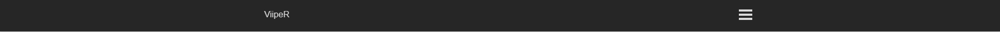
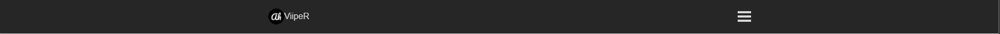
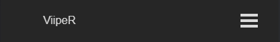
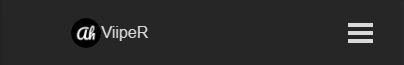

# Svelte Components/Navbar.svelte (v1.1)
### Here is a presentation of the button and a preview.

```html
<script>
    import { Navbar } from "./components/Navbar/Navbar.svelte" // edit with the path to the Navbar.svelte file
</script>

<Navbar websiteName="ViipeR"> <!-- You can also add an image by adding the websiteLogo argument -->
    <li><a href="/about">About</a></li>
	<li><a href="/blog">Blog</a></li>
	<li><a href="/careers">Careers</a></li>
	<li><a href="/contact">Contact</a></li>

    <!-- Every new link needs to be in a li that contains a link to the page -->
</Navbar>

<!-- If you want to edit the style of the button like the background-color, you have to do it as global like it -->
<style>
    :global(#navbar) {
        background-color: #000; /* Change the navbar's background color to black */
    }
</style>
```

# Preview of the default button
### Normal
 <br>
 <br>

### Responsive
 <br>
 <br>