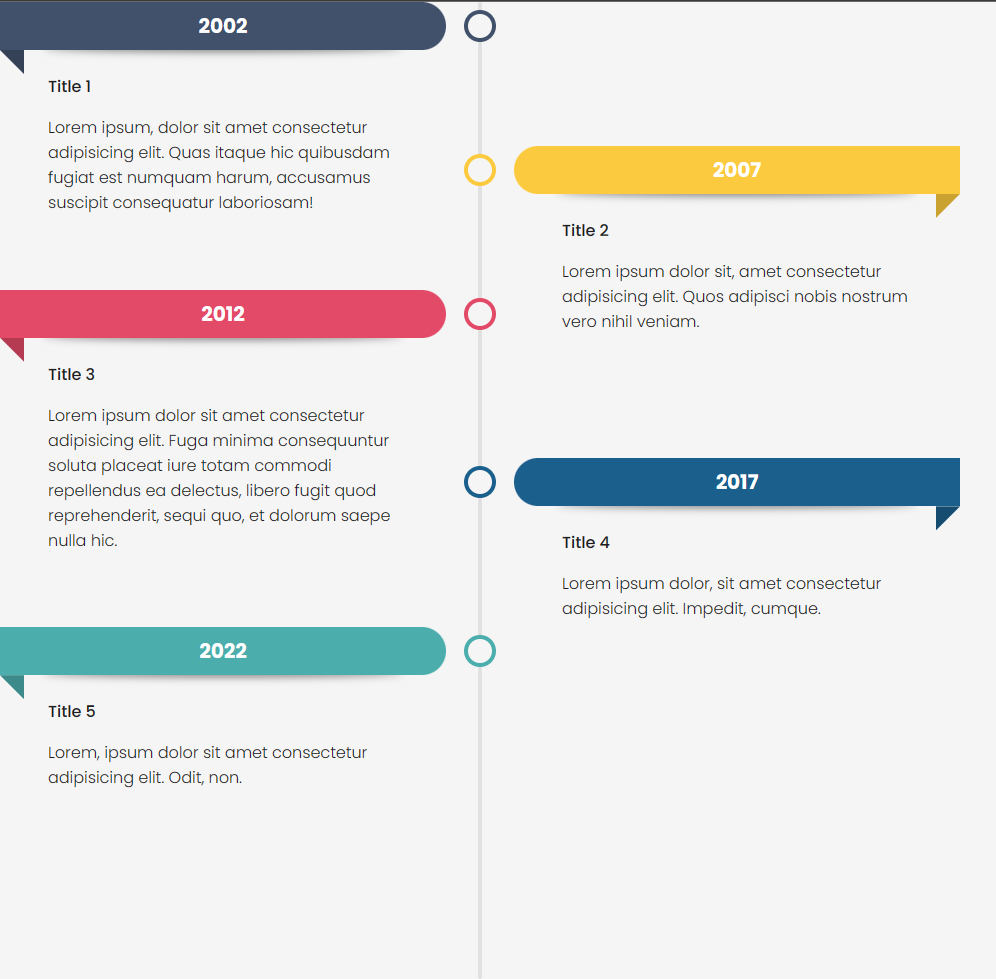

# Svelte Components/Timeline.svelte (v1.0)

### Here is a presentation of the timeline and a preview.

```html
<script>
	import { Timeline } from "./components/Timeline/Timeline.svelte"; // edit with the path to the Timeline.svelte file
</script>

<Timeline>
	<li style="--accent-color:#41516C">
		<div>2002</div>
		<div>Title 1</div>
		<div>
			Lorem ipsum, dolor sit amet consectetur adipisicing elit. Quas itaque hic quibusdam fugiat est
			numquam harum, accusamus suscipit consequatur laboriosam!
		</div>
	</li>
	<li style="--accent-color:#FBCA3E">
		<div>2007</div>
		<div>Title 2</div>
		<div>
			Lorem ipsum dolor sit, amet consectetur adipisicing elit. Quos adipisci nobis nostrum vero
			nihil veniam.
		</div>
	</li>
	<li style="--accent-color:#E24A68">
		<div>2012</div>
		<div>Title 3</div>
		<div>
			Lorem ipsum dolor sit amet consectetur adipisicing elit. Fuga minima consequuntur soluta
			placeat iure totam commodi repellendus ea delectus, libero fugit quod reprehenderit, sequi
			quo, et dolorum saepe nulla hic.
		</div>
	</li>
	<li style="--accent-color:#1B5F8C">
		<div>2017</div>
		<div>Title 4</div>
		<div>Lorem ipsum dolor, sit amet consectetur adipisicing elit. Impedit, cumque.</div>
	</li>
	<li style="--accent-color:#4CADAD">
		<div>2022</div>
		<div>Title 5</div>
		<div>Lorem, ipsum dolor sit amet consectetur adipisicing elit. Odit, non.</div>
	</li>

	<!-- Every new element needs to be in a li that contains 3 divs, first the date, secondly the title and finally the content -->
</Timeline>

<!-- All the styles are globals but I don't recommend to edit one. Although, make as you want! -->
<style>
	:global(element) {
		/* Style */
	}
</style>
```

# Preview of the default timeline

### Normal

 <br>
